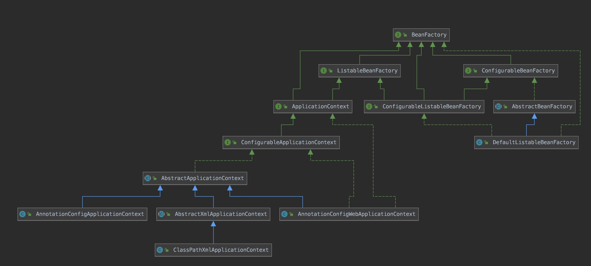

### 概述

在Spring中有许许多多的Container，包括Beans、Core、Context、SpEL

* core和beans模块提供了Spring框架的基础，包括IoC和DI
* Context建立在Core和beans模块提供的基础之上，提供了框架是访问对象的方式
* SpEL是Spring提供的一种在运行时操作对象的表达式语言

<!-- more -->

### SpringIoC

* 官方文档对SpringIoc的描述

```java
In Spring, the objects that form the backbone of your application and that are managed by the Spring IoC container are called beans. A bean is an object that is instantiated, assembled, and otherwise managed by a Spring IoC container. Otherwise, a bean is simply one of many objects in your application. Beans, and the dependencies among them, are reflected in the configuration metadata used by a container.
```

究其大意，是将传统创建Java对象的模式转变成为由IoC去创建，让其成为有生命周期的Bean对象，并将Bean对象存放在Ioc中，同时，还提供一系列接口来操作这些Bean对象的元数据，可以看成是Spring Bean关系的集合。

###BeanFactory

####Spring 5.x源码描述

```java
The root interface for accessing a Spring bean container.
This is the basic client view of a bean container;
```

简单易懂，这是一个Bean容器的根接口，是一个从上帝视角去看待Bean容器的狠角色！他是爸爸！

####BeanFactory的追随者



如图所示，BeanFactory是一个顶层接口，从名称看就是一个Bean工厂，猜测是用来生产Bean的，带着猜测看代码。

```java
public interface BeanFactory {
  //获取FactoryBean，&为转义标识
	String FACTORY_BEAN_PREFIX = "&";
  
  //通过名称获取Bean
	Object getBean(String name) throws BeansException;
	<T> T getBean(String name, @Nullable Class<T> requiredType) throws BeansException;
	Object getBean(String name, Object... args) throws BeansException;
  
  //通过类型获取Bean
	<T> T getBean(Class<T> requiredType) throws BeansException;
	<T> T getBean(Class<T> requiredType, Object... args) throws BeansException;
  
  ///通过名称获取Bean，然后进行判断
	boolean containsBean(String name);
	boolean isSingleton(String name) throws NoSuchBeanDefinitionException;
	boolean isPrototype(String name) throws NoSuchBeanDefinitionException;
  
  ///通过名称获取Bean，然后判断类型
	boolean isTypeMatch(String name, ResolvableType typeToMatch) throws   	              NoSuchBeanDefinitionException;
	boolean isTypeMatch(String name, @Nullable Class<?> typeToMatch) throws NoSuchBeanDefinitionException;
  
  //通过名称获取Bean，然后获取类型
	Class<?> getType(String name) throws NoSuchBeanDefinitionException;
  
  //获取别名
	String[] getAliases(String name);
}
```

​		BeanFactory接口提供了各种获取bean的方法，那么谁可以实现此接口呢？源码中已经给出了描述足可以解释BeanFactory是怎么使用，干什么用，为什么要用，无需赘述。

```java
	1、This interface is implemented by objects that hold a number of bean definitions,each uniquely identified by a String name. Depending on the bean definition,the factory will return either an independent instance of a contained object(the Prototype design pattern), or a single shared instance
    
	2、The point of this approach is that the BeanFactory is a central registry of application components, and centralizes configuration of application components (no more do individual objects need to read properties files,for example). See chapters 4 and 11 of "Expert One-on-One J2EE Design and Development" for a discussion of the benefits of this approach.
```

​		第一段：这个接口可以被一个**容纳BeanDefinition**的对象实现，每个BeanDefinition有一个独一无二的的名字。根据BeanDefinition，这个Factory可以返回一个原型（Prototype）或者单例（Single）对象。

​		第二段：这个方法的要点是BeanFactory是一个应用程序的组件、配置的中心注册器。可以看**《Expert One-on-One J2EE Design and Development》**这本书的第4和第11张对于这个优势的讨论。ps：这本书我估计很多人没听过更没读过。

### BeanDefinition

先看BeanDefinition源码描述：

```
A BeanDefinition describes a bean instance, which has property values,constructor argument values, and further information supplied by concrete implementations.
```

上一节引出BeanDefinition，我们知道它是存在BeanFactory中，可知BeanDefinition就是Spring Bean，但在实际应用中，表示一个Spring Bean是在classpath下定义如下xml：

```java
<bean id="gson" class="com.google.gson.Gson"/>
```

一个xml配置为何能成为一个Spring Bean?既然BeanFactory是来存BeanDefinition的，而且用什么存还不知道，那么BeanFactory如何才能让xml中的配置文件转变成BeanDefinition并且存起来的呢，这里就延伸了出了一个个**ClassPathXMLApplicationContext**类，第一节图中可看出此类为BeanFactory子类，说明在此类也是一个Bean工厂，断点看源码执行路径如下：

* AbstractXmlApplicationContext#loadBeanDefinitions
* XmlBeanDefinitionReader#loadBeanDefinitions
* XmlBeanDefinitionReader#doLoadBeanDefinitions
* XmlBeanDefinitionReader#registerBeanDefinitions
* BeanDefinitionDocumentReader#registerBeanDefinitions
* DefaultBeanDefinitionDocumentReader#doRegisterBeanDefinitions
* DefaultBeanDefinitionDocumentReader#parseBeanDefinitions
* DefaultBeanDefinitionDocumentReader#parseDefaultElement
* DefaultBeanDefinitionDocumentReader#processBeanDefinition
* BeanDefinitionParserDelegate#parseBeanDefinitionElement
* BeanDefinitionParserDelegate#createBeanDefinition
* BeanDefinitionReaderUtils#createBeanDefinition

走了这么长，看下create代码有什么骚操作：

```java
public static AbstractBeanDefinition createBeanDefinition(
			@Nullable String parentName, @Nullable String className, @Nullable ClassLoader classLoader) throws ClassNotFoundException {

		GenericBeanDefinition bd = new GenericBeanDefinition();
		bd.setParentName(parentName);
		if (className != null) {
			if (classLoader != null) {
				bd.setBeanClass(ClassUtils.forName(className, classLoader));
			}
			else {
				bd.setBeanClassName(className);
			}
		}
		return
```

没有。简而言之，Spring 通过加载xml配置文件，解析Element标签，生成对应的BeanDefinition，最后通过BeanDefinitionReaderUtils.registerBeanDefinition(bdHolder, getReaderContext().getRegistry()) 注入到IoC容器中，从Utils进去简单看看用什么存的BeanDefinition：

```java
/** Map of bean definition objects, keyed by bean name */
private final Map<String, BeanDefinition> beanDefinitionMap = new ConcurrentHashMap<>(256);

/** List of bean definition names, in registration order */
private volatile List<String> beanDefinitionNames = new ArrayList<>(256);
```

### 总结

至此，Spring已经将bean加载到容器中，但此时在Map中的bean只是最基本的对象，可以说跟普通的Java对象无异，只是增加了一些属性，那么Spring在何时进行属性注入、对象验证、功能增强的呢？白银篇将继续为你揭开面纱。


​																		每日诗词：

​												君不见，黄河之水天上来，奔流到海不复回。

​												君不见，高堂明镜悲白发，朝如青丝暮成雪。

​												人生得意须尽欢，莫使金樽空对月。

​												天生我材必有用，千金散尽还复来。

​												烹羊宰牛且为乐，会须一饮三百杯。

​												岑夫子，丹丘生，将进酒，杯莫停。

​												与君歌一曲，请君为我倾耳听。

​												钟鼓馔玉不足贵，但愿长醉不复醒。

​												古来圣贤皆寂寞，惟有饮者留其名。

​												陈王昔时宴平乐，斗酒十千恣欢谑。

​												主人何为言少钱，径须沽取对君酌。

​												五花马，千金裘，呼儿将出换美酒，与尔同销万古愁。

​																									-- 李白《将进酒》

