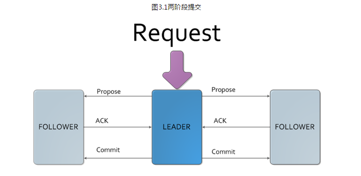

### 处理步骤

1. 将事务日志保存到本地
2. 广播事务请求给所有follower节点
3. follwoer节点处理完以后会给一个ack
4. leader根据接受到的ack进行判断是否大于half，如果是，则发起commit请求并广播
5. leaderj将数据同步给observer

<!-- more -->



```properties
所有非Leader的服务器收到来自客户端的事务请求，都会已Request的方式转发到Leader服务器处理
```

### 处理Proposal流程

* 生成Proposal  zK将请求头、事务体、ZXID、请求本身序列化到Proposal对象
*  广播提议
* 广播接收端通过sync流程记录事务日志并返回ACK，如果半数获得通过，则进入commit环节
* 向Flowwer、Observer广播COMMIT消息

### 处理Sync流程

*  针对每个时请求，都会通过事务日志的方式将其记录下来，记录完成后，向服务器发送ACK消息表明记录完成。

### 处理Commit流程

* 将事务从事务日志应用到内存数据库。