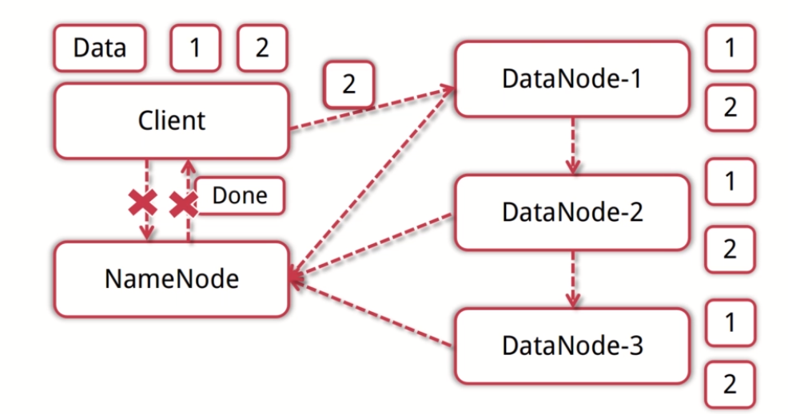
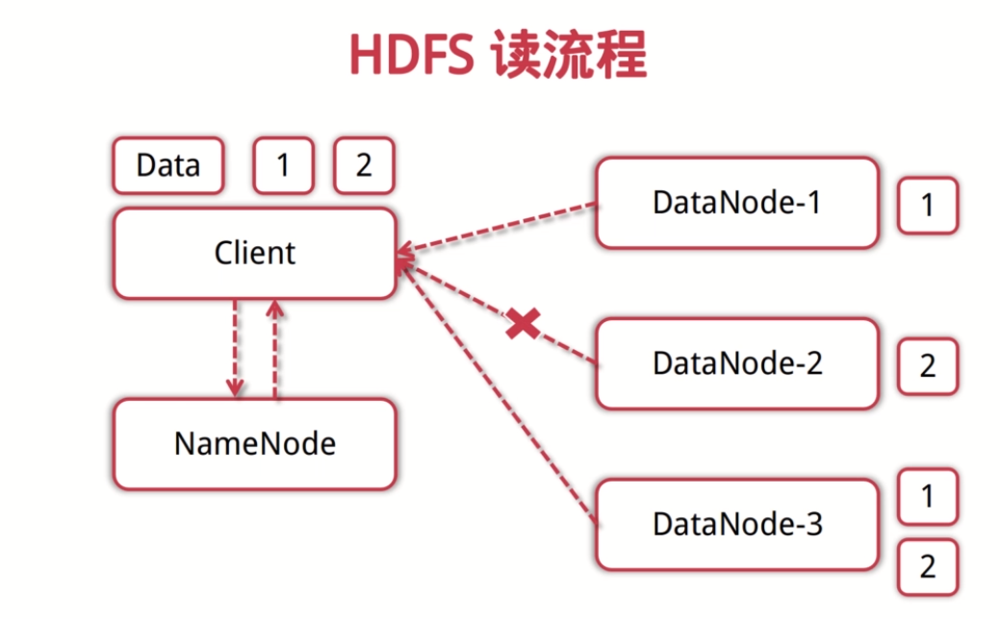

### Hadoop是什么

* Hadoop是一个开源的大数据框架
* Hadoop是一个分布式计算的解决方案
* Hadoop=HDFS（分布式文件系统）+MapReduce（分布式计算）

<!-- more -->

### Hadoop核心之HDFS

* HDFS分布式文件系统：存储是大数据技术的基础

  * 数据块
    * 数据库是抽象快而非整个文件作为存储单元；默认64MB，一般设置为128MB，存三块，将数据进行分块，存放在不同的快中，提高容错能力
  * NameNode
    * 主，管理文件系统的命名空间，存放文件元数据，维护文件系统的所有文件和目录，文件和数据块的映射，记录每个文件中各个块所在数据节点的信息
  * DataNode
    * 从，工作节点，存储并检索数据块，向NameNode更新所存储块的列表
  * 优点
    * 适合大文件的存储，支持TB、PB的数据存储，并有副本机制，可以构建在廉价的机器上，并有一定的容错和恢复机制，支持流失数据访问，一次写入，多次读取最高效；
  * 缺点
    * 不适合大量小文件的存储
    * 不适合并发写入，不支持文件随机修改
    * 不支持随机读等延时的访问方式

* HDFS写流程

  * 客户端向NameNode发起写数据请求
  * 分块写入DataNode节点，DataNode自动完成副本备份
  * DataNode向NameNode汇报存储完成，NameNode通知客户端

  

* HDFS读流程

  * 客户端向NameNode发起读数据请求

  * NameNode找到距离最近的DataNode节点信息

  * 客户从DataNode分块下载文件

    

###Hadoop核心之MapReduce

* MapReduce编程模型：分布式计算是大数据应用的解决方案
  * 输入一个大文件，通过Split之后，将其分为多个分片
  * 每个文件分片由单独的机器去处理，这就是Map方法
  * 将各个机器计算结果进行汇总并得到最终的结果，这就是Reduce方法
* ResourceManager
  * 分配和调度资源
* ApplicationMaster
  * 负责数据切分
  * 监控任务的执行及容错
* NodeManager
  * 管理单个节点的资源
  * 处理来自ResourceManager的命令
  * 处理来自ApplicationManager的命令

